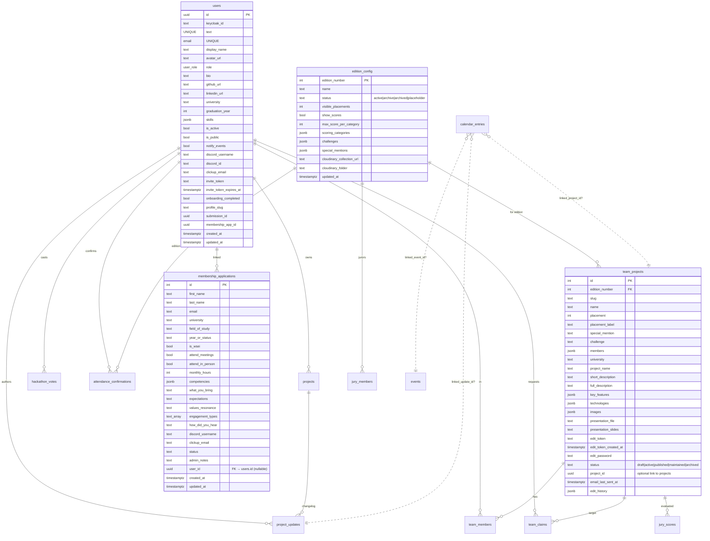

# Model danych — PostgreSQL

## Migracje

Migracje w `migrations/0001…0020_*.sql` — numerowane, ale **nie są uruchamiane automatycznie**. Startup `server.js` wywołuje `CREATE TABLE IF NOT EXISTS` + `ALTER TABLE ADD COLUMN IF NOT EXISTS` bezpośrednio (line ~240+). Pliki migracji są source-of-truth dla schema + used w dev/fresh clone.

## Główne tabele



## Wybrane szczegóły

### `user_role` enum (migracja 0002 + 0010)

```sql
CREATE TYPE user_role AS ENUM (
  'admin', 'moderator', 'participant', 'jury'       -- 0002
);
ALTER TYPE user_role ADD VALUE 'hackathon-participant';  -- 0010
ALTER TYPE user_role ADD VALUE 'scienceclub-participant'; -- 0010
```

### Kluczowe relacje

- `users.keycloak_id` — UUID z Keycloak realm. Unique. Backfilled przy pierwszym logowaniu (SELECT WHERE email, UPDATE keycloak_id).
- `users.profile_slug` — auto-generated przy pierwszej edycji display_name (PATCH /me). Preserved once set.
- `membership_applications.user_id` — link po acceptance (admin `create-profile` ustawia). NULLowane gdy user usunięty.
- `team_projects.edit_token` — unique token dla email edit flow (team leader dostaje link do własnej karty).
- `calendar_entries.linked_*` — optional joins do projects/events/updates (event/project milestone widoczny w kalendarzu).

### Indeksy (wybrane)

```sql
CREATE INDEX idx_users_email ON users(email);
CREATE INDEX idx_users_keycloak_id ON users(keycloak_id) WHERE keycloak_id IS NOT NULL;
CREATE INDEX idx_users_role ON users(role);
CREATE INDEX idx_users_discord_username ON users (LOWER(discord_username)) WHERE discord_username IS NOT NULL;
CREATE INDEX idx_users_discord_id ON users (discord_id) WHERE discord_id IS NOT NULL;
-- team_projects, hackathon_votes, attendance_confirmations itp. — w migracjach
```

## Wyzwania do audytu

1. **Brak FK constraintów** w niektórych miejscach — np. `membership_applications.user_id` jest UUID bez FK constraint (legacy). Cleanup przy DELETE usera manualny (null-out w DELETE endpoincie).
2. **`users.submission_id` + `membership_app_id`** — UUID pola, ale `membership_applications.id` jest integerem. Link `membership_apps → users` działa przez `membership_applications.user_id → users.id`, ale w drugą stronę jest niespójny.
3. **`skills: jsonb`** — array of strings, ale bez enum'a. Różne wpisy mogą mieć literówki ("React" vs "react" vs "ReactJS").
4. **`discord_id`** jest nullable — populate'owane dopiero gdy (future) Discord OAuth. Na razie tylko `discord_username` (free text, podatne na literówki).
5. **`jury_scores.scores_json`** — jsonb per juror per project. Brak strict schema — każda edycja może mieć inne `scoring_categories` w `edition_config`.

## Migracje ALTER w runtime (server.js ~240-290)

Te ALTER TABLE są wywoływane przy każdym starcie serwera (idempotentnie — IF NOT EXISTS). Oznacza to że nowy kolumnowy migration można dodać tu + w `migrations/NNNN_*.sql` i po deployu DB już ma nową kolumnę. **Nie stosować** destructive operations (DROP, NOT NULL bez DEFAULT).

Aktualnie migrowane w runtime:
- `team_projects`: email_last_sent_at, edit_password, edit_history
- `jury_scores`: scores_json, jury_access_id, private_notes
- `edition_config`: cloudinary_collection_url, cloudinary_folder
- `membership_applications`: how_did_you_hear, discord_username, clickup_email
- `users`: discord_username, discord_id, clickup_email + indexy
- `attendance_confirmations`, `project_updates`, `calendar_entries` — CREATE TABLE IF NOT EXISTS
