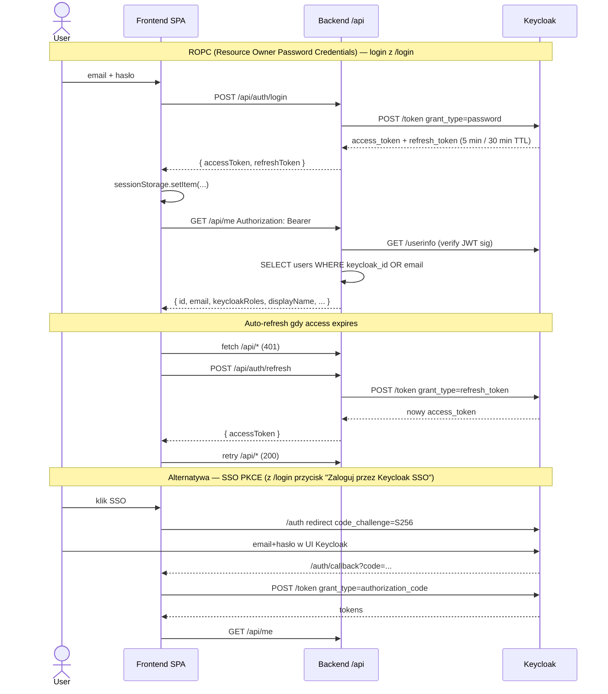

# Architektura — overview

## Wysokopoziomowy diagram usług

```mermaid
flowchart LR
  Browser[Przeglądarka uczestnika/admina]

  subgraph Railway[Railway workspace "Michał Madejski's Projects"]
    subgraph KrakHackLanding[KrakHackLanding service]
      Frontend[React SPA\n/dist/index.html + index.js]
      Backend[Express API\nserver.js port 8080]
    end
    Keycloak[(Keycloak\nrealm: krakhack)]
    Postgres[(PostgreSQL\npublic schema)]
  end

  subgraph External[Zewnętrzne]
    Resend[Resend Email API\n2 domeny: krakhack.info + possibilitieslab.org]
    Cloudinary[Cloudinary\ngaleria zdjęć]
    SMSAPI[SMSAPI\nwysyłka SMS]
    Groq[Groq/OpenAI\nAI Compass LLM]
  end

  Browser -->|HTTPS| Frontend
  Frontend -->|fetch /api/*| Backend
  Frontend -->|PKCE OIDC| Keycloak
  Backend -->|JWT verify| Keycloak
  Backend -->|pg pool| Postgres
  Backend -->|REST| Resend
  Backend -->|REST| Cloudinary
  Backend -->|REST| SMSAPI
  Backend -->|REST| Groq
```

## Struktura kodu (frontend)

```
src/
  app/
    Layout.tsx                         # globalne: navbar + footer
    routes.tsx                         # definicje route'ów React Router
    components/
      AdminApplications.tsx            # /panel/admin/aplikacje — aplikacje do koła
      AdminDashboard.tsx               # /panel/admin/rejestracje — stary admin (embedded tabs)
      AdminUsersPage.tsx               # /panel/admin/uzytkownicy
      AdminGallery.tsx, AdminResults.tsx, AdminTeamProjects.tsx, AdminCertificates.tsx, …
      membership/MembershipWizard.tsx  # /dolacz — formularz aplikacji
      calendar/CalendarMonth.tsx       # kalendarz wydarzeń (publiczny)
      project/ProjectUpdatesAdmin.tsx  # changelog projektów
      ProtectedRoute.tsx               # guard dla route'ów wymagających role
    pages/
      HomePage.tsx, DemoPage.tsx       # strony publiczne
      Logowanie.tsx, ForgotPasswordPage.tsx
      JuryPanel.tsx                    # standalone /jury/:token
      Edition2026.tsx, Edition2025.tsx # archiwalne strony edycji
      panel/
        PanelLayout.tsx                # sidebar + outlet — WSZYSTKIE /panel/*
        PanelHome.tsx                  # /panel — dashboard role-aware
        ProfilePage.tsx                # /panel/profil — edycja własnego profilu
        ProjectsPage.tsx, ProjectEditPage.tsx
        TeamClaimPage.tsx              # /panel/moj-zespol
        navConfig.ts                   # deklaratywna konfiguracja sidebara
        ContextSwitcher.tsx            # KRAK HACK / LAB / SYSTEM toggle
        usePreviewScope.ts             # admin preview mode (?preview=hackathon)
        admin/                         # wszystkie strony /panel/admin/*
          krakhack/                    # hackathon-specific admin (edycje, zespoły-view, dashboard)
          lab/                         # koło-specific admin (kompas)
  contexts/
    AuthContext.tsx                    # JWT + refresh + /api/me
  lib/
    adminApi.ts                        # adminFetch() z auto-retry 401
  data/
    edition-registry.ts                # hardkodowane meta edycji (legacy — migracja do DB w toku)
```

## Struktura kodu (backend)

`server.js` to monolit ~8k linii. Organizacja wewnętrzna:

```
// ~500    Email helpers (sendResendEmail, resolveEmailFrom, templates)
// ~600    SMS helper
// ~700    Keycloak admin helpers (getKeycloakAdminToken, createKeycloakUser, resetKeycloakPassword)
// ~850    Auth endpoints: /api/auth/login, /refresh, /forgot-password
// ~900    /api/me + /api/panel/users + /api/panel/me
// ~1100   /api/invite/bulk, /api/admin/integrations/request-fill
// ~1420   /api/panel/users/:id/resend-invite
// ~1500   /api/auth/forgot-password
// ~1580   /api/membership-applications/bulk/create-profile
// ~1620   /api/calendar + /api/calendar.ics
// ~1750   /api/invite/send (legacy)
// ~1920   Attendance legacy
// ~2100   /api/config/:key (key-value site config)
// ~2430   /api/submissions (formularze legacy)
// ~2900   /api/teams/:slug (team edit)
// ~3000   Event notify + bot webhook
// ~3300   /api/admin/mail/* (mailing bulk)
// ~4200   /api/certificates/*
// ~4500   Memberhip applications CRUD + create-profile
// ~4600   /api/jury/* (magic link, scoring)
// ~4800   Membership endpoints (submit, accept, welcome)
// ~5200   AI Compass
// ~5500   Jury magic link
// ~5800   Editions CRUD
// ~6200   Team projects admin
// ~6400   /api/public/* (participants, projects, results)
// ~6700   Cloudinary gallery
// ~7300   Collaborations
// ~7500   SMS endpoints
// ~7700   Platform contact
// ~8000   SPA catch-all + listen
```

## Przepływ logowania



**Uwaga:** ROPC fail'uje gdy user ma Keycloak required action (np. UPDATE_PASSWORD po create-profile). Wtedy `/login` wyświetla amber banner "Użyj Keycloak SSO" — wtedy user przechodzi przez Keycloak UI, ustawia nowe hasło, wraca do panelu.

## Role system — streszczenie

Szczegóły: [roles.md](roles.md).

| Rola Keycloak | Rola DB (`user_role` enum) | Dostęp do panelu |
|---|---|---|
| `admin` | `admin` | Wszystko |
| `moderator` | `moderator` | Aplikacje, Users (edit), Team claims, Rejestracje (bez create konta) |
| `hackathon-participant` | `hackathon-participant` | Profil, Projekty, Mój zespół, Moja obecność, Głosowanie |
| `scienceclub-participant` | `scienceclub-participant` | Profil, Projekty, Mój kompas, Głosowanie |
| `jury` | `jury` | Tylko standalone `/jury/:token` (magic link) — `/panel` jest "guide screen" |
| (brak) | `hackathon-participant` (domyślna przy pierwszym login) | Profil, Projekty tylko |

Poza tym admin ma **preview mode** (`?preview=hackathon|scienceclub|jury`) — może podglądać panel tak jak zwykły uczestnik bez zmiany własnych ról w Keycloak.

## Dalej

- [data-model.md](data-model.md) — schema PostgreSQL
- [email.md](email.md) — sender split + templates
- [roles.md](roles.md) — szczegóły uprawnień per endpoint
